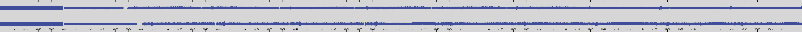
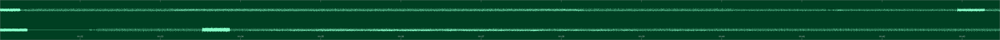
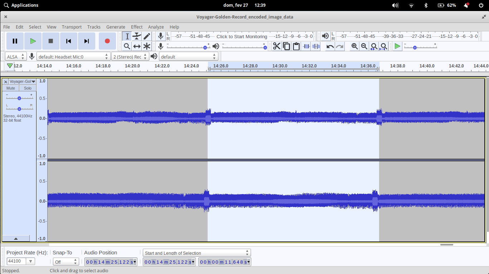
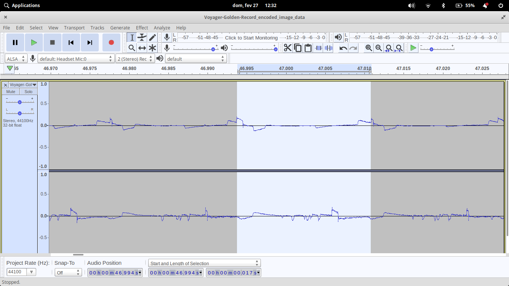
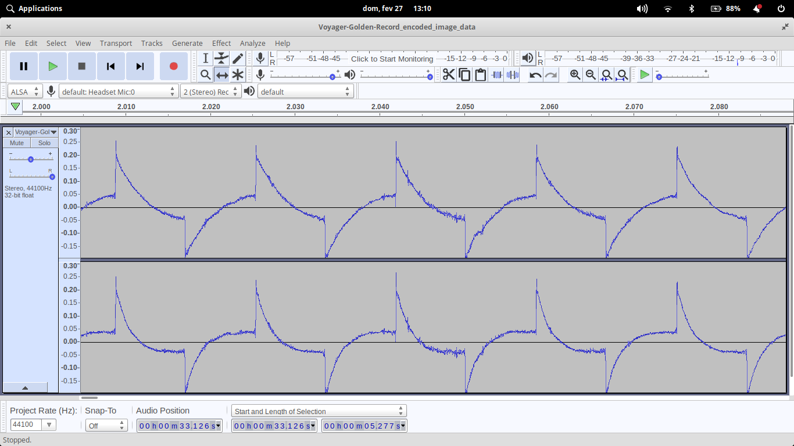
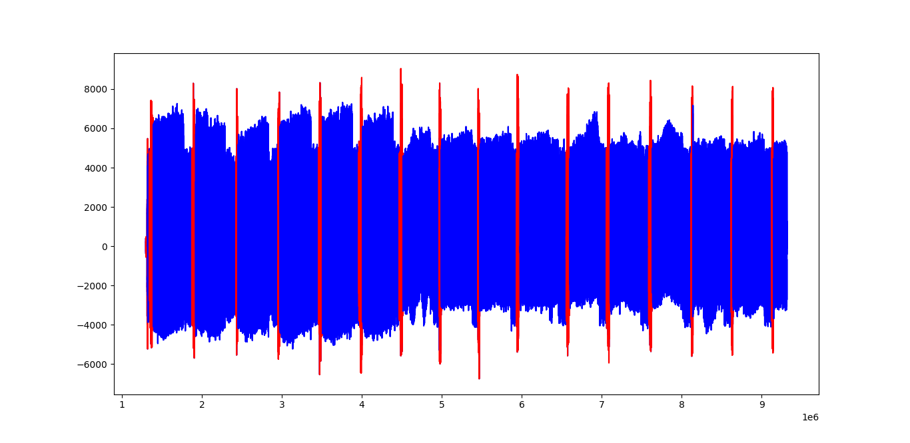
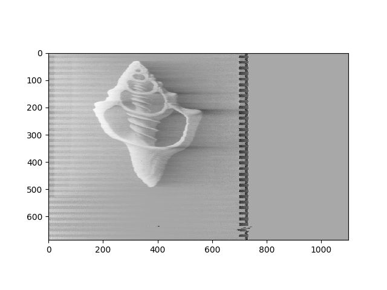
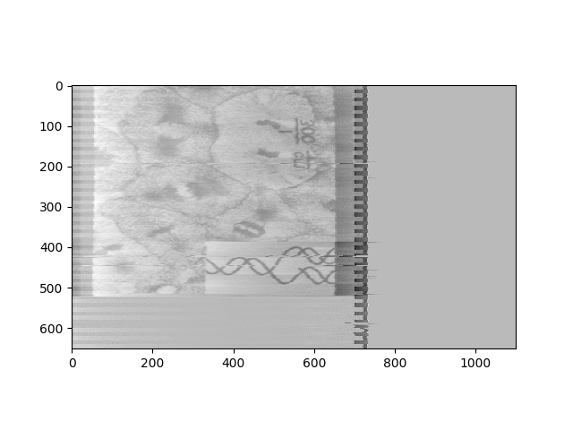
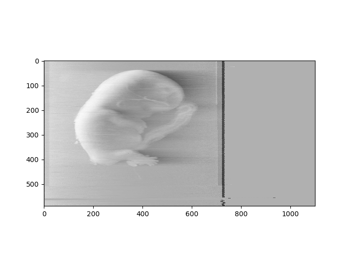
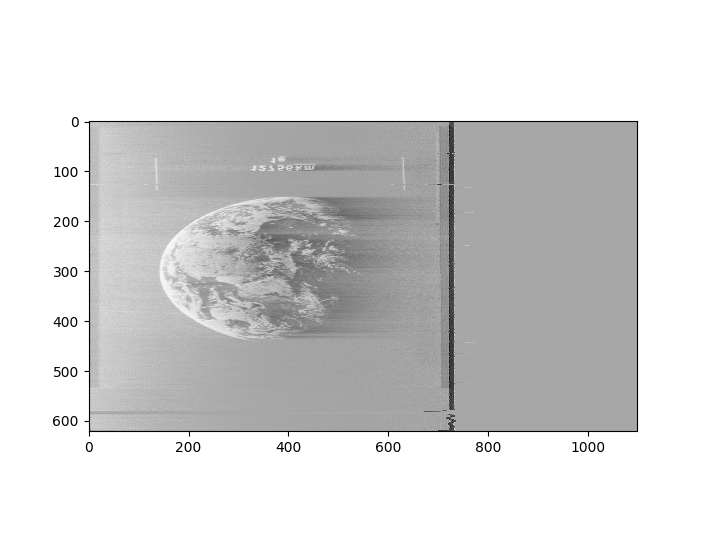

# DECODING VOYAGER GOLDEN DISK IMAGES


The audio file profile i have available is the following (in two channels):

[Voyager-Golden-Record_encoded_image_data.mp3](README_data/Voyager-Golden-Record_encoded_image_data.mp3)

- the audio was recorded in half the velocity it should’ve been, so we must consider that now we will have an span of ~0.017 for image.

The general pattern is as following:





We should expect an image to be `0.0083s * 512 =~ 4.25s` long (or twice that for our audio file)



Each image in the audio is divided in lines (512), that can be found in series of the aspect below (using audacity as the software to visualize the audio)



A problem with the audio files is that we have a digital compensation in the taping. To see that, it was expected to have, in the beginning of the file we should have an zigzag as expressed in the disk cover. But we have something like:



But again, that shouldn’t be too much of a problem but to separate parts and to have some noise. So, now, for the coding.

We need to create separate mp3 file for that sections. It is important to cut it between the first peak you think is relevant (is important to understand the data beforehand) and the last peak of interest in the section of the image. (We have peaks that separate each line of the image).

 To do that, we’ll try an density approach that was the best i could think of. It basically reads the data in sections and calculates the density of points above a threshold (separation sections appears to have more high amplitude points in less space). 

To get less fake positives we do it twice with different parameters and compare results only marking the sections that both sets of parameters find to be separators. Finally, we read our labels for sections and segregate together areas with more density so we don’t have any holes. 

We will end up with something of the type:



Witch is not perfect but yeah, pretty good. We some modifying in the parameters I’m pretty sure we can get with confidence the separators.

Now we of course cut sections. In my case, I saved each in a .txt file, witch I found easier to do. The code for all the above is as follows:

```python
#relevant imports
import numpy as np
import pydub as pd

# global variables
SIZE = 400 # size of region to wich we calculate the density
INIT = 1300000 # point of init on mp3 file that we want to read
END = INIT + SIZE*130000 # end of the region to wich we read
GROUP = 60 # number of pre-groups to wich we recalculate the density
AUDIO_PATH = "audios/Voyager-Golden-Record_encoded_image_data.mp3"

#configurations
# amplitude_threshold -> threshold to wich we consider a peak
# density_threshold -> threshold to wich we consider a dense area
config1 = {'AMPLITUDE_THRESHOLD' : 1000, 'DENSITY_THRESHOLD' : 0.30} #configuration 1
config2 = {'AMPLITUDE_THRESHOLD' : 2000, 'DENSITY_THRESHOLD' : 0.30} #configuration 2

#densities
density1 = [] #density of configuration 1
density2 = [] #density of configuration 2
true_density = [] #density of re-calculated groups

#read the mp3 file
def read_mp3(filename):
    #read the mp3 file
    song = pd.AudioSegment.from_mp3(filename)
    #separate the channels
    left, right = song.split_to_mono()[0], song.split_to_mono()[1]
    #convert the channels to numpy arrays
    left_array = np.array(left.get_array_of_samples())
    right_array = np.array(right.get_array_of_samples())
    #return the arrays
    return left_array, right_array


#read the mp3 file
left_array, right_array = read_mp3(AUDIO_PATH)
#loop over the arrays
i = 0
for array in (left_array, right_array):
    # define folder to save results
    folder = ('left', 'right')[i]
    for i in range(INIT, END, SIZE):
        # count the number of peaks in a given region
        counter = [0,0]
        for j in array[i:i+SIZE]:
            if j > config1['AMPLITUDE_THRESHOLD'] : counter[0] += 1
            if j > config2['AMPLITUDE_THRESHOLD'] : counter[1] += 1
        region_density = [counter[0]/SIZE, counter[1]/SIZE]
        if region_density[0] > config1['DENSITY_THRESHOLD']: # if the region is dense in configuration 1
            density1.append(1)
        else:
            density1.append(0)
        if region_density[1] > config2['DENSITY_THRESHOLD']: # if the region is dense in configuration 2
            density2.append(1)
        else:
            density2.append(0)
        index = (i-INIT)//SIZE # index of the region
        if density1[index] & density2[index]: # if the region is dense in both configurations
            true_density.append(1)
        else:
            true_density.append(0)
        
    new_label = [] # new label for the regions

    # define regions with high density
    for i in range(INIT, END, SIZE*GROUP): # loop over the regions to redefine dense
        counter = 0
        for j in true_density[(i-INIT)//SIZE:(i-INIT)//(SIZE)+(GROUP)]:
            if j: counter += 1
        if counter > 1:
            new_label.append(1)
        else:
            new_label.append(0)
    # divide original array into groups based on new_label
    # we need to start in a non sequence of zeros (->000...)
    # (->100...) works
    start = []
    end = []
    for i in range(1, len(new_label)-1):
        if new_label[i] == 0:
            if new_label[i+1] == 0:
                if new_label[i-1] == 1:
                    start.append(INIT+(i)*SIZE*GROUP)
            else:
                if new_label[i-1] == 0:
                    end.append(INIT+(i)*SIZE*GROUP)
        
        
    for item in range(len(end)): 
        with open(f"text/{folder}/text_{item}.txt", "w") as f: # save the text file
            np.savetxt(f, array[start[item]:end[item]], fmt="%d")
    
    i =+ 1
    print(i)
```

Now, for each image. The idea is quite simple based on how the images are encoded. We need to find the first peak on our data, witch is the beginning of an image line. We should have something around 512 lines. 

Most of the times we can’t count on that because the cuts may be imperfect. The first peak found (it should be in the first 800 points (this is an arbitrary number based on observations of the data)), we can find the next peak and put everything in between in a line of the matrix. Or i first though. Turns out peaks are good to find but horrible markers in the data to use as the line beginners. That’s because of an data imperfect where the peak, not a zig-zag as it should be, alternates in distance from the next one. There is an easy fix: to use the valleys, they are a lot more reliable in distance.

There is something we should note. As we’re dealing with an imprecise data, we may have some lines with more points than others that will be a problem when plotting the matrix. So we make it a fixed number of points so it will have a margin to wobble. I found that 1100 is a fair number to use.

The last relevant comment is that, adding an plt.plot() in the end of the loop we can see the images as they’re generated. You’re ginna notice that most of then have some imperfect lines. If you resize the matplot tab you can manage to end this imperfections. I’m not sure why, but it works :)

The code for this section is:

```python
#relevant imports
import numpy as np
import matplotlib.pyplot as plt

# global variables
RANGE_FIRST_PEAK = 800 # range of the first peak
RANGE_SEARCH_VALLEY = 50 # range of the first valley
MATRIX_SIZE = 1100 # size of the matrix
SIZE_OF_SEARCH = 1000 # size of the search region
MARGIN = 100 # margin to wich we start to search for the first peak

# loop over both folders where we keep the txt files with the arrays
for folder in ('left', 'right'):
    i = 0
    flag = True
    while flag:
        matrix = np.array([]) # matrix to wich we append the values

        try : # try to read the txt file
            with open(f'text/{folder}/text_{i}.txt', 'r') as f:
                text = f.readlines()
        except : # if the file does not exist, we stop the loop
            flag = False
            continue

        for j in range(len(text)): 
            text[j] = int(text[j][:-1]) # remove the \n at the end of the line

        peak = np.argmax(text[0:RANGE_FIRST_PEAK]) # find the first peak
        valley = np.argmin(text[peak:peak+RANGE_SEARCH_VALLEY]) + peak # find the first valley

        image_left = True # define if there are still size to keep searching
        while image_left:
            # check if there is image left
            if valley + SIZE_OF_SEARCH > len(text):
                image_left = False
            else:
                #   check next SIZE_OF_SEARCH points for a peak and valley
                next_peak = np.argmax(text[peak+MARGIN:peak+SIZE_OF_SEARCH]) + peak + MARGIN
                next_valley = np.argmin(text[next_peak:next_peak+RANGE_SEARCH_VALLEY]) + next_peak
                # add section to matrix line with MATRIX_SIZE points
                matrix = np.cdcdappend(matrix, text[valley:next_valley]+[0]*(MATRIX_SIZE-(next_valley-valley)))
                # update peak
                peak = next_peak
                # update valley
                valley = next_valley
        
        matrix = matrix.reshape(-1,MATRIX_SIZE) # reshape the matrix
        plt.imshow(matrix, cmap='Greys', interpolation='nearest') # plot the matrix
        plt.savefig(f'images/{folder}/image_{i}.png', aspect='auto') # save the image
        i += 1
        print(i) # print the number of the image so we can keep track of advances
```

We get results of the type:



But we can, as said, improve our results by moving the matplot tab. But again,
not viable for all images, because it's extremely boring.

